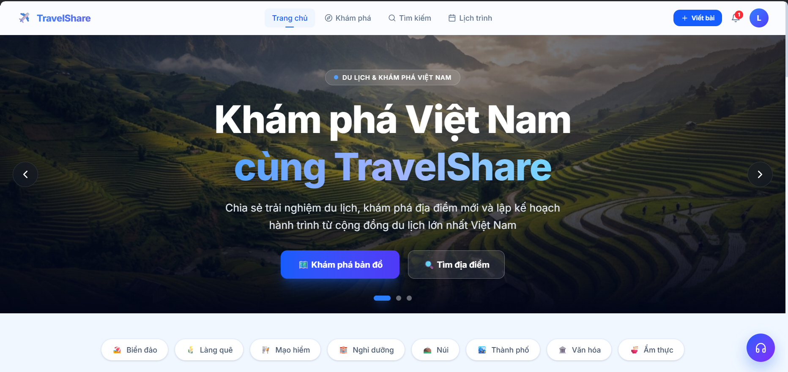

# Đồ Án Môn Học Lập Trình Web Nâng Cao
# Đề tài: TravelShare – Nền Tảng Chia Sẻ Hành Trình Du Lịch

## Giới thiệu chung

**TravelShare** là một nền tảng mạng xã hội du lịch hiện đại, cho phép người dùng chia sẻ trải nghiệm khám phá địa điểm, kết nối cộng đồng yêu du lịch và lập kế hoạch hành trình thông minh. Dự án được xây dựng toàn diện với đầy đủ các tính năng mạng xã hội (đăng bài, bình luận, theo dõi, thông báo), quản lý lịch trình du lịch, thanh toán trực tuyến qua **VNPay** và tạo lịch trình tự động bằng **Trí tuệ Nhân tạo (Groq Compound Mini)**.



## Mục lục (Table of Contents)

1. [Tính năng nổi bật](#tinh-nang-noi-bat)
2. [Kiến trúc và Công nghệ](#kien-truc-va-cong-nghe)
3. [Cấu hình và Cài đặt](#cau-hinh-va-cai-dat)
4. [Cách sử dụng](#cach-su-dung)
5. [Liên hệ](#lien-he)

---

<a id="tinh-nang-noi-bat"></a>
## ✨ Tính năng nổi bật

Các chức năng chính được triển khai và phân chia rõ ràng theo từng vai trò người dùng:

### 1. Tính năng chung

* **Xác thực & Bảo mật:** Đăng ký, đăng nhập an toàn sử dụng JWT (Access Token + Refresh Token). Xác thực OTP qua Email cho các thao tác nhạy cảm. Phân quyền rõ ràng: **Admin** và **User**.
* **Mạng xã hội du lịch:** Đăng bài chia sẻ kèm hình ảnh, bình luận, thích (like), lưu bài viết, theo dõi người dùng và khám phá địa điểm du lịch.
* **Giao tiếp Realtime:** Chat hỗ trợ khách hàng thời gian thực giữa người dùng và Admin (sử dụng **Socket.io**). Trợ lý AI tự động phản hồi khi Admin không online.
* **Thông báo Realtime:** Hệ thống thông báo tức thời về các tương tác mới (like, bình luận, đăng bài, giao dịch, v.v.).

### 2. Người dùng (User)

* **Khám phá & Tìm kiếm:** Duyệt bài viết theo xu hướng (trending), tìm kiếm theo địa điểm/tên/danh mục, xem địa điểm du lịch trên bản đồ tương tác (Leaflet / OpenStreetMap).
* **Quản lý bài viết:** Tạo, chỉnh sửa, xóa bài chia sẻ trải nghiệm du lịch kèm ảnh (upload lên Cloudinary), đánh dấu địa điểm trên bản đồ.
* **Lập lịch trình du lịch:** Tự tạo lịch trình thủ công theo từng ngày, hoặc **tự động tạo lịch trình bằng AI** (Groq Compound Mini) phân bổ địa điểm, gợi ý thời gian sáng/chiều/tối theo ngân sách và phong cách.
* **Mua lượt AI:** Thanh toán trực tuyến qua cổng **VNPay** để mua thêm lượt sử dụng tính năng AI Trip Generator với xác thực chữ ký HMAC-SHA512.
* **Báo cáo vi phạm:** Báo cáo bài viết hoặc bình luận không phù hợp để quản trị viên xét duyệt.

### 3. Quản trị viên (Admin)

* **Quản lý Hệ thống:** Quản lý toàn bộ tài khoản người dùng, duyệt/xử lý báo cáo vi phạm nội dung, quản lý danh mục địa điểm.
* **Quản lý Giao dịch:** Theo dõi toàn bộ lịch sử giao dịch VNPay, trạng thái thanh toán (pending, success, failed, expired).
* **Hỗ trợ khách hàng:** Giao diện Dashboard Chat chuyên nghiệp để quản lý và phản hồi trực tiếp các cuộc hội thoại từ người dùng theo thời gian thực.
* **Thống kê & Báo cáo:** Xem tổng quan số liệu hệ thống: tổng người dùng, bài viết, địa điểm, doanh thu giao dịch và báo cáo vi phạm chờ xử lý.
* **Gửi Thông báo:** Tạo và gửi thông báo hệ thống đến toàn bộ hoặc từng người dùng cụ thể.

---

<a id="kien-truc-va-cong-nghe"></a>
## 💻 Kiến trúc và Công nghệ

Dự án được xây dựng theo mô hình **Client-Server** (tách biệt hoàn toàn Backend API và Frontend React SPA), triển khai production qua **Docker Compose + Nginx**.

### Backend

| Công nghệ | Vai trò chính | Badge |
| :--- | :--- | :--- |
| **Node.js & Express** | Nền tảng server và xây dựng RESTful API |   |
| **MongoDB & Mongoose** | Hệ quản trị CSDL NoSQL, ODM và MongoDB Atlas Transactions |  |
| **Socket.io** | Truyền thông thời gian thực (Realtime Chat & Notifications) |  |
| **Groq AI – Compound Mini** | Tự động tạo lịch trình du lịch thông minh bằng AI |  |
| **Cloudinary** | Lưu trữ và tối ưu hình ảnh bài viết trên Cloud |  |
| **VNPAY** | Cổng thanh toán điện tử với HMAC-SHA512 & IPN Webhook |  |
| **Nodemailer** | Gửi OTP và email xác thực qua Gmail SMTP |  |
| **JSON Web Token** | Xác thực Access Token & Refresh Token |  |

### Frontend

| Công nghệ | Vai trò chính | Badge |
| :--- | :--- | :--- |
| **React 19** | Thư viện xây dựng giao diện người dùng |  |
| **Vite** | Công cụ build frontend nhanh chóng |  |
| **Redux Toolkit** | Quản lý global state (auth, user profile) |  |
| **React Router DOM v7** | Bộ định tuyến Client-side |  |
| **Tailwind CSS v4** | Framework CSS hiện đại giúp thiết kế UI nhanh chóng |  |
| **Leaflet / React-Leaflet** | Hiển thị bản đồ tương tác, đánh dấu địa điểm (OpenStreetMap) |  |
| **Axios** | HTTP Client giao tiếp với Backend API |  |
| **Socket.io Client** | Kết nối realtime với Backend |  |

### Triển khai (DevOps)

| Công nghệ | Vai trò chính | Badge |
| :--- | :--- | :--- |
| **Docker & Docker Compose** | Đóng gói và quản lý đa container (Backend + Frontend + Nginx) |  |
| **Nginx** | Reverse Proxy, phục vụ React SPA và định tuyến API |  |
| **MongoDB Atlas** | Cơ sở dữ liệu Cloud với Replica Set hỗ trợ Transactions |  |

---

<a id="cau-hinh-va-cai-dat"></a>
## 🔧 Cấu hình và Cài đặt

### Yêu cầu hệ thống

* **Node.js** >= 18.x
* **npm** >= 9.x
* **Docker & Docker Compose** (nếu chạy bằng container)
* Tài khoản **MongoDB Atlas** (Cluster có Replica Set để hỗ trợ Transactions)
* Tài khoản **Cloudinary** (lưu trữ ảnh)
* **GROQ API Key** – đăng ký tại [console.groq.com](https://console.groq.com)
* Tài khoản **VNPay Sandbox** – đăng ký tại [sandbox.vnpayment.vn](https://sandbox.vnpayment.vn)

---

### Cách 1: Chạy thủ công (Development)

#### Bước 1 – Clone Repository
```bash
git clone <repository-url>
cd travelshare
```

#### Bước 2 – Cài đặt và cấu hình Backend
```bash
cd backend
npm install
```

Tạo file `.env` dựa theo file `.env.example` và điền các giá trị tương ứng:
```properties
# ===================== DATABASE =====================
MONGODB_URI=mongodb+srv://<username>:<password>@cluster0.xxxxx.mongodb.net/travelshare?retryWrites=true&w=majority

# ===================== JWT =====================
JWT_SECRET=your-super-secret-jwt-key
JWT_REFRESH_SECRET=your-super-secret-refresh-key
JWT_EXPIRE=15m
JWT_REFRESH_EXPIRE=7d

# ===================== SERVER =====================
PORT=5000
NODE_ENV=development
CLIENT_URL=http://localhost:5173

# ===================== AI SERVICES =====================
GROQ_API_KEY=gsk_your_groq_api_key_here
GEMINI_API_KEY=your_gemini_api_key_here

# ===================== CLOUDINARY =====================
CLOUDINARY_CLOUD_NAME=your_cloud_name
CLOUDINARY_API_KEY=your_api_key
CLOUDINARY_API_SECRET=your_api_secret

# ===================== EMAIL (Gmail SMTP) =====================
MAIL_HOST=smtp.gmail.com
MAIL_PORT=587
MAIL_USER=your_email@gmail.com
MAIL_PASSWORD=your_app_password
MAIL_FROM=noreply@travelshare.com

# ===================== VNPAY SANDBOX =====================
VNPAY_TMN_CODE=your-vnpay-tmn-code
VNPAY_HASH_SECRET=your-vnpay-hash-secret
VNPAY_URL=https://sandbox.vnpayment.vn/paymentv2/vpcpay.html
VNPAY_RETURN_URL=http://localhost/api/payment/vnpay-return
VNPAY_IPN_URL=https://your-ngrok-domain.ngrok-free.dev/api/payment/vnpay-ipn

# ===================== DEV ONLY =====================
ALLOW_TEST_OTP=true
```

Khởi chạy backend:
```bash
npm run dev
```
> Backend chạy tại: `http://localhost:5000`

#### Bước 3 – Cài đặt và cấu hình Frontend
```bash
cd ../frontend
npm install
```

Tạo file `.env` trong thư mục frontend:
```properties
VITE_API_URL=http://localhost:5000/api
VITE_SOCKET_URL=http://localhost:5000
```

Khởi chạy frontend:
```bash
npm run dev
```
> Frontend chạy tại: `http://localhost:5173`

---

### Cách 2: Triển khai bằng Docker 🐳

Dự án hỗ trợ chạy toàn bộ ứng dụng qua Docker Compose (Backend + Frontend/Nginx trong cùng network).

#### Chuẩn bị
* Đã cài đặt **Docker Desktop** và **Docker Compose**.
* Đã tạo và cấu hình đầy đủ file `backend/.env` theo hướng dẫn ở Bước 2.

#### Khởi chạy tất cả dịch vụ
Tại thư mục gốc của dự án:
```bash
docker compose up --build -d
```

Lệnh trên sẽ tự động:
1. Build image **Backend** từ `backend/Dockerfile` (Node.js 20 Alpine).
2. Build image **Frontend** từ `frontend/Dockerfile` (Vite Build + Nginx Alpine).
3. Khởi chạy container `travelshare-backend` trên cổng **5000**.
4. Khởi chạy container `travelshare-frontend` (Nginx Reverse Proxy) trên cổng **80**.
5. Health check tự động – frontend chờ backend sẵn sàng trước khi start.

#### Kiểm tra trạng thái
```bash
docker ps
```

#### Xem log
```bash
docker logs travelshare-backend -f
docker logs travelshare-frontend -f
```

#### Dừng tất cả dịch vụ
```bash
docker compose down
```

---

<a id="cach-su-dung"></a>
## 🚀 Cách sử dụng

### 1. Truy cập ứng dụng

| Môi trường | URL |
| :--- | :--- |
| **Development – Frontend** | `http://localhost:5173` |
| **Development – Backend API** | `http://localhost:5000` |
| **Docker Production** | `http://localhost` (port 80) |

### 2. Tài khoản kiểm thử mẫu (Demo Accounts)

| Vai trò | Email | Mật khẩu | Ghi chú |
| :--- | :--- | :--- | :--- |
| **Admin** | `admin@travelshare.com` | *(liên hệ tác giả)* | Quản trị toàn hệ thống |
| **User** | Đăng ký trực tiếp trên giao diện | | Xác thực OTP qua Email |

### 3. Kiểm thử thanh toán VNPay Sandbox

| Thông tin | Giá trị |
| :--- | :--- |
| **Ngân hàng** | NCB |
| **Số thẻ** | `9704198526191432198` |
| **Tên chủ thẻ** | `NGUYEN VAN A` |
| **Ngày phát hành** | `07/15` |
| **OTP xác thực** | `123456` |

---

<a id="lien-he"></a>
## 📧 Liên hệ


* **Tác giả:** Nguyễn Trung Hậu
* **Email:** popola957th@gmail.com

